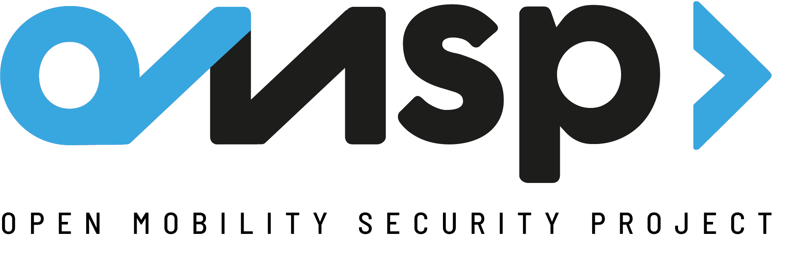

# OMSP - Open Mobility Security Project

## Abstract  

OMSP (acronym from Open Mobility Security Project) is an open source project dedicated to the creation of a standard framework with technical controls to review security in all types of vehicles. This project was born as an internal project, used by Zerolynx to perform security reviews of several systems integrated within different vehicles, as cars and trains. Inspired by the popular [OWASP WSTG](https://github.com/OWASP/wstg) project, we decided to release OMSP as an open project, so that the community can get involved, contributing with its knowledge and experience in the field, and therefore, improving the cybersecurity of our vehicles.

OMSP is not a high-level generic guide, nor it's limited to very specific systems which has been already covered in the past. OMSP aims to cover each possible technical test that could be performed on all of the systems and subsystems that are part of the vehicle and its environment. Let’s make it clear: with OMSP we would like to cover the entire threat landscape that could affect our vehicles.

OMSP includes a list of control categories, which group together several controls that allow combining different technical tests to which all the components that make up the vehicle systems and subsystems could be subjected. Specifically, OMSP is focussed on cars, car sharing platforms, and trains, connected or non-connected, although we would like to expand this project to other vehicles such as motorcycles, electric scooters, or even airplanes!

We are currently working on release version 1.0. You can [read the current document here on GitHub](./document/).

## Targets

*	**Non-connected cars**: Traditionally, cars have been exclusively mechanical machines or, at most, with some basic electronic system. However, this architecture evolved from the 90's to one with an onboard computer that controles a bunch of sensors and actuators at various parts of the vehicle, all of these connected through the wired network core and with some wireless sensors with differents standarts.  

*	**Connected cars**: Nowadays, vehicles begin to establish Internet connections, either to download information about the realtime traffic state, or to offer new entertainment services such as the access to YouTube or Netflix, to browse the Internet from the car, or to remotly control some of the car actions/functions through the mobile application. This way, the vehicle attack surface acquires new dimensions, since it is no longer an isolated entity that only could be attacked physically, but it is a one more element with Internet connection, and therefore is reachable for the attacker. On the other hand, there are greats steps forward autonomous driving, installing new sensors, actuators and control equipments with Artificial Intelligence in cars.     
	
*	**Car sharing**: Car sharing vehicles have special operations that differs from the rest of connected cars. They have integrated systems that, on the one hand, allow users to perform a series of operations with mobile phone, and on the other hand, allow providers to control the vehicle and perform remote configurations and information transmitions through the Internet. These cars integrate special devices based on IoT, that provides them with feauters to interact through technologies such as mobile connectivity (3G/4G), NFC, Bluetooth or Wi-Fi. 

*	**Trains**: Trains are a special type of transport that runs on static tracks. Their traction and braking systems are controlled by a driver, however, these systems can be also interfered by automatic security system. For the correct work of this system, the train constantly communicates with the traffic control center and with the tracks in which it circulates, through static beacons that provide information to the train. As connected cars, trains have moved from being isolated elements to being connected machines, with associated risks similar to those of them.  

## Cyber Mobility Attack Chain 

The vehicles previously mentioned can be cyberattacked from their different state and interface. The following figure describes a group of states from which could be performed different attacks depending on the current condition of the vehicle and the opponent. In it, some attacks are defined that can be perform with the vehicle in stationary and in motion, from inside and outside it, and remotely or closely, through its different driving and connection interfaces, through the entertainment system and through integrated remote control systems.

Based on this, twelve categories of controls have been defined, which also are subdivided into different technical cybersecurity controls, which bring together all the tests that can be executed on each of these vehicles.

The Cyber Mobility Attack Chain has been completed with other categories of controls which, even if they don't directly affect the vehicles, have been considered of interest to be included in the project. In them, aspects such as test environment where built-in (developed and tested) software, electrical chargin points, as well as other assets that in time are considered of interest for the project, will be reviewed and evaluated. All this is detailed in the following sections.

# Contributing

1. [Fork it](https://github.com/zerolynx/omsp/fork)
2. Download your fork to your PC (`git clone https://github.com/your_username/omsp && cd omsp`)
3. Create your feature branch (`git checkout -b my-new-feature`)
4. Make changes and add them (`git add .`)
5. Commit your changes (`git commit -m 'Add some feature'`)
6. Push to the branch (`git push origin my-new-feature`)
7. Create new pull request

# Project Team

## Project Leaders

- [Juan Antonio Calles](https://twitter.com/jantonioCalles)
- [Luis Vázquez](https://twitter.com/macgruap)
- [Francisco Palma](https://twitter.com/1c3t0rm)
- [Martín Puga](https://www.linkedin.com/in/mpegea/)

## Contributors, Editors and Translators 

- [Mercedes Muñoz](https://twitter.com/mikiminoru)
- [Jesús Alcalde](https://twitter.com/jalcaldea)
- [Jorge Escabias](https://twitter.com/MrSquid25)
- [Yevheniy Kushch](https://twitter.com/YevKushch)
- [David Jiménez](https://twitter.com/djimenezco)
- [José Hermoso](https://twitter.com/_f1lth_)

# Global References
*	["Enisa good practices for security of Smart Cars". European Union Agency For Cybersecurity (ENISA). 2019. ISBN 978-92-9204-317-9](https://www.enisa.europa.eu/publications/enisa-good-practices-for-security-of-smart-cars)
*	["CYRail Recommendations on cybersecurity of rail signalling and communication systems". CYRail Consortium. 2018. ISBN 978-2-7461-2747-0](https://cyrail.eu/IMG/pdf/final_recommendations_cyrail.pdf)
*	["Car Hacker's Handbook. A Guide for the Penetration Tester". Craig Smith. 2016. ISBN 1-59327-703-2](http://opengarages.org/handbook/ebook/)
*	["Hacking Connected Cars: Tactics, Techniques, and Procedures". Alissa Knight. 2020. ISBN 978-1-119-49173-6](https://www.wiley.com/en-es/Hacking+Connected+Cars%3A+Tactics%2C+Techniques%2C+and+Procedures-p-9781119491736)
*	["Building your Car Hacking Labs & Car Hacking Community from Scratch". Jay Turla. Slideshare. 2019](https://www.slideshare.net/JayTurla2/building-your-car-hacking-labs-car-hacking-community-from-scratch)
